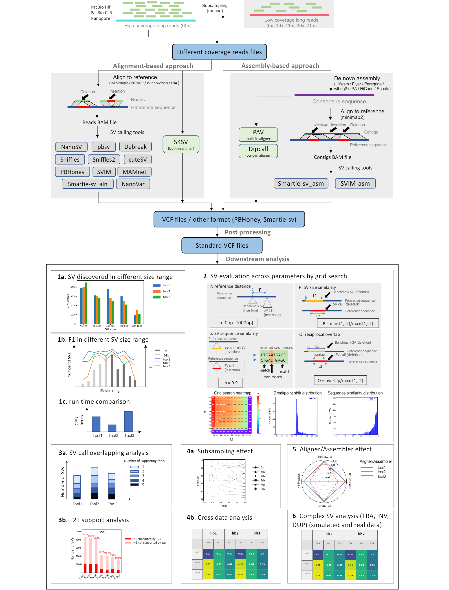

# Long Read Based SV Calling Tools Analysis
# Table of Contents
1. [Intro](#Intro)
1. Related Datasets and Softwares
    1. [Datasets](docs/Datasets.md)
    1. [Aligners](docs/Aligners.md)
    1. [Assemblers](docs/Assemblers.md)
    1. [SV Callers](docs/SVCallers.md)
    1. [SV Evaluators](docs/SVEvaluators.md)
1. [Analysis Code Readme](bin/README.md)
1. [Data Availability](#Data-Availability)

# Intro
In this project, we comprehensively evaluated the performance of 16 long read based SV calling methods along with 4 upstream aligners and 7 assemblers, and offered guidelines and recommendations under 28 criteria for users to select the optimal tools based on different scenarios and directions for further method development. The pipeline of our evaluation was shown as below:

# Data Availability
All VCF files generated for evaluation can be found [zenodo](https://doi.org/10.5281/zenodo.7199897).
