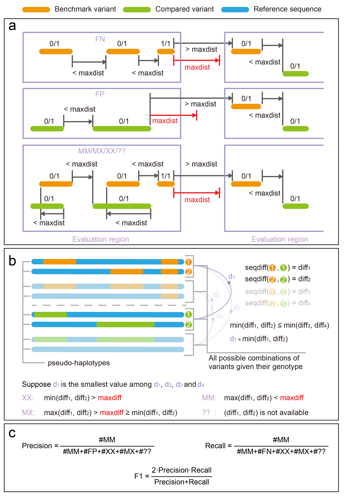

# SV Evaluators
**Special Note:** The benchmark VCFs and high confidence BED file are provided [here](https://github.com/maiziezhoulab/LRSV_combo/tree/main/benchmarks) 
# Table of Contents
- [Truvari](#Truvari)
- [hap-eval](#hap-eval)
- [SURVIVOR](#SURVIVOR)


# Truvari
## Project Links
### Github Repo:
https://github.com/ACEnglish/truvari
### Publication:
Truvari: refined structural variant comparison preserves allelic diversity

https://doi.org/10.1186/s13059-022-02840-6
#### BibTeX
```
@article{english2022truvari,
  title={Truvari: refined structural variant comparison preserves allelic diversity},
  author={English, Adam C and Menon, Vipin K and Gibbs, Richard A and Metcalf, Ginger A and Sedlazeck, Fritz J},
  journal={Genome Biology},
  volume={23},
  number={1},
  pages={1--20},
  year={2022},
  publisher={Springer}
}
```
## Installation & Dependencies
### Installation Methods
See [here](https://github.com/acenglish/truvari/wiki/Installation)
### Dependencies
```
Not explicilty mentioned. Handled by Conda/Mamba/pip
```
## Inputs & Outputs
### Inputs
Bench VCF, Compared VCF, reference genome fasta file, and BED file that specifies the regions to compare
### Outputs
fn.vcf, fp.vcf, tp-base.vcf (TP in bench vcf), tp-call.vcf (TP in compared vcf), summary.txt (statistics like recall, precision etc.), log.txt
## Commands used
```
prefix=${the file name of your VCF (.vcf suffix removed)}
ref=${reference_genome}
bed=HG002_SVs_Tier1_v0.6_chr_noXY.bed

bench=HG002_SVs_Tier1_v0.6_chr_noXY.vcf.gz
bench_del=HG002_SVs_Tier1_v0.6_chr_del_noXY.vcf.gz
bench_ins=HG002_SVs_Tier1_v0.6_chr_ins_noXY.vcf.gz

out_dir=Truvari_${prefix}_p0

p=0
P=0.5
r=500
# This example is comparing the SVs within 50~1kbp size range 
minsize=50
maxsize=1000

rm -r ${out_dir}

mkdir ${out_dir}


python vcf_filter.py -v ./${prefix}.vcf --remove_small_sv -o_dir . #if running on Dipcall result, please add --dipcall flag

vcf-sort ${prefix}_DEL_INS_noXY.vcf > ${prefix}_DEL_INS_noXY_sorted.vcf
bgzip -c ${prefix}_DEL_INS_noXY_sorted.vcf > ${prefix}_DEL_INS_noXY_sorted.vcf.gz
tabix -p vcf ${prefix}_DEL_INS_noXY_sorted.vcf.gz

vcf-sort ${prefix}_DEL_noXY.vcf > ${prefix}_DEL_noXY_sorted.vcf
bgzip -c ${prefix}_DEL_noXY_sorted.vcf > ${prefix}_DEL_noXY_sorted.vcf.gz
tabix -p vcf ${prefix}_DEL_noXY_sorted.vcf.gz

vcf-sort ${prefix}_INS_noXY.vcf > ${prefix}_INS_noXY_sorted.vcf
bgzip -c ${prefix}_INS_noXY_sorted.vcf > ${prefix}_INS_noXY_sorted.vcf.gz
tabix -p vcf ${prefix}_INS_noXY_sorted.vcf.gz

truvari bench -b ${bench} -c ${prefix}_DEL_INS_noXY_sorted.vcf.gz -f ${ref} -o ${out_dir}/INS_DEL_50_1k --includebed ${bed} -p ${p} -P ${P} -r ${r} --passonly --sizemin ${minsize} --sizemax ${maxsize}

truvari bench -b ${bench_del} -c ${prefix}_DEL_noXY_sorted.vcf.gz -f ${ref} -o ${out_dir}/DEL_50_1k --includebed ${bed} -p ${p} -P ${P} -r ${r} --passonly --sizemin ${minsize} --sizemax ${maxsize}

truvari bench -b ${bench_ins} -c ${prefix}_INS_noXY_sorted.vcf.gz -f ${ref} -o ${out_dir}/INS_50_1k  --includebed ${bed} -p ${p} -P ${P} -r ${r} --passonly --sizemin ${minsize} --sizemax ${maxsize}

```
## Other notes
1.For more detailed usage, please refer to their [wiki page](https://github.com/ACEnglish/truvari/wiki)

# hap-eval
## Project Links
### Github Repo:
https://github.com/Sentieon/hap-eval

### Publication:
Currently None

#### BibTeX
```
@webpage{hapeval,
	title  = {A VCF comparison engine for structual variant benchmarking},
	url = {https://github.com/Sentieon/hap-eval}
```
## Installation & Dependencies
### Installation Methods
```
git clone --recurse-submodules https://github.com/Sentieon/hap-eval.git
pip install ./hap-eval
```
### Dependencies
```
Handled by pip
```
## Inputs & Outputs
### Inputs
Bench VCF, Compared VCF, reference genome fasta file, and BED file that specifies the regions to compare
### Outputs
base_out.vcf, comp_out.vcf. Recall, precision and F1 etc. are outputted to stdout
## Commands used
```
prefix=${the file name of your VCF (.vcf suffix removed)}
vcf_dir=${path to the folder that contains the vcf}

maxdiff=0.5
maxdist=500

ref=${reference_genome}
bed=HG002_SVs_Tier1_v0.6_chr_noXY.bed

bench_del=HG002_SVs_Tier1_v0.6_chr_del_noXY.vcf.gz
bench_ins=HG002_SVs_Tier1_v0.6_chr_ins_noXY.vcf.gz

rm -r hap-eval_${prefix}_hm
mkdir hap-eval_${prefix}_hm

cd hap-eval_${prefix}_hm

python vcf_filter.py --remove_small_sv --passonly -v ${vcf_dir}/${prefix}.vcf -o_dir . #if running on Dipcall result, please add --dipcall flag

vcf-sort ${prefix}_DEL_noXY_passonly.vcf > ${prefix}_DEL_noXY_passonly_sorted.vcf
bgzip -c ${prefix}_DEL_noXY_passonly_sorted.vcf > ${prefix}_DEL_noXY_passonly_sorted.vcf.gz
tabix -p vcf ${prefix}_DEL_noXY_passonly_sorted.vcf.gz

vcf-sort ${prefix}_INS_noXY_passonly.vcf > ${prefix}_INS_noXY_passonly_sorted.vcf
bgzip -c ${prefix}_INS_noXY_passonly_sorted.vcf > ${prefix}_INS_noXY_passonly_sorted.vcf.gz
tabix -p vcf ${prefix}_INS_noXY_passonly_sorted.vcf.gz

hap_eval -r ${ref} -i ${bed} -b ${bench_del} -c ${prefix}_DEL_noXY_passonly_sorted.vcf.gz --base_out DEL_base_out.vcf --comp_out DEL_comp_out.vcf --maxdist ${maxdist} --minsize 50 --maxdiff ${maxdiff}

hap_eval -r ${ref} -i ${bed} -b ${bench_ins} -c ${prefix}_INS_noXY_passonly_sorted.vcf.gz --base_out INS_base_out.vcf --comp_out INS_comp_out.vcf --maxdist ${maxdist} --minsize 50 --maxdiff ${maxdiff}
```
## Other notes
### Pipeline and parameter definition


### Limitations
1. hap-eval has a built-in filter that will only take the SV records that have `PASS` in the `FILTER` field (similar to the `--passonly` flag in Truvari). This can be disabled, but need to modify the source code.
2. hap-eval requires genotype information, otherwise the output will be all zero
3. hap-eval may not be compatitable with the VCF header provided by some callers:
	```
	cuteSV
	##FORMAT=<ID=DR,Number=1,Type=String,Description="# High-quality reference reads">
	##FORMAT=<ID=DV,Number=1,Type=String,Description="# High-quality variant reads">
	##FORMAT=<ID=PL,Number=G,Type=String,Description="# Phred-scaled genotype likelihoods rounded to the closest integer">
	##FORMAT=<ID=GQ,Number=1,Type=String,Description="# Genotype quality">
	                                ^
	Original: Integer Now: String

	DeBreak
	##INFO=<ID=MAPQ,Number=1,Type=Float,Description="Mean mapping quality of supporting reads">
	                                ^
	Original: Integer Now: Float
	```

# SURVIVOR
## Project Links
### Github Repo:

https://github.com/fritzsedlazeck/SURVIVOR

### Publication:

Transient structural variations have strong effects on quantitative traits and reproductive isolation in fission yeast.

https://doi.org/10.1038/ncomms14061

#### BibTeX
```
@article{english2022truvari,
  title={Transient structural variations have strong effects on quantitative traits and reproductive isolation in fission yeast},
  author={Jeffares, Daniel C.},
  journal={Nature communication},
  volume={8},
  number={14061},
  year={2017},
  publisher={Springer Nature}
}

```
## Installation & Dependencies
### Installation Methods

```
git clone https://github.com/fritzsedlazeck/SURVIVOR.git
cd SURVIVOR/Debug
make
```

### Dependencies
```
Not specified
```
## Inputs & Outputs
### Inputs
tumor cell VCF file
normal cell VCF file
### Outputs
Tumor-specific VCF file

## Commands used
```
#### input #####

vcffile_normal=${1}
vcffile_cancer=${2}
outdir=${3}/


mkdir -p ${outdir}
prefix=variants
prefix_normal=${prefix}_normal
prefix_cancer=${prefix}_cancer

######### split normal vcf #########

grep "#" ${vcffile_normal}>${outdir}header
cat ${vcffile_normal} | grep -w "SVTYPE=BND\|SVTYPE=TRA" > ${outdir}${prefix_normal}_BND.body
cat ${outdir}header ${outdir}${prefix_normal}_BND.body > ${outdir}${prefix_normal}_BND.vcf
cat ${vcffile_normal} | grep -w -v "SVTYPE=BND\|SVTYPE=TRA" > ${outdir}${prefix_normal}_noBND.vcf
/data/maiziezhou_lab/CanLuo/Software/SURVIVOR/Debug/SURVIVOR filter ${outdir}${prefix_normal}_noBND.vcf NA 50 100 0 -1  ${outdir}${prefix_normal}_noBND_50_100.vcf
/data/maiziezhou_lab/CanLuo/Software/SURVIVOR/Debug/SURVIVOR filter ${outdir}${prefix_normal}_noBND.vcf NA 101 500 0 -1  ${outdir}${prefix_normal}_noBND_101_500.vcf
/data/maiziezhou_lab/CanLuo/Software/SURVIVOR/Debug/SURVIVOR filter ${outdir}${prefix_normal}_noBND.vcf NA 501 1000 0 -1  ${outdir}${prefix_normal}_noBND_501_1000.vcf
/data/maiziezhou_lab/CanLuo/Software/SURVIVOR/Debug/SURVIVOR filter ${outdir}${prefix_normal}_noBND.vcf NA 1001 30000 0 -1  ${outdir}${prefix_normal}_noBND_1001_30000.vcf
/data/maiziezhou_lab/CanLuo/Software/SURVIVOR/Debug/SURVIVOR filter ${outdir}${prefix_normal}_noBND.vcf NA   30000 -1 0 -1  ${outdir}${prefix_normal}_noBND_30000_.vcf


######### split cancer vcf #########

grep "#" ${vcffile_cancer}>${outdir}header
cat ${vcffile_cancer} | grep -w "SVTYPE=BND" > ${outdir}${prefix_cancer}_BND.body
cat ${outdir}header ${outdir}${prefix_cancer}_BND.body > ${outdir}${prefix_cancer}_BND.vcf
cat ${vcffile_cancer} | grep -w -v "SVTYPE=BND" > ${outdir}${prefix_cancer}_noBND.vcf
/data/maiziezhou_lab/CanLuo/Software/SURVIVOR/Debug/SURVIVOR filter ${outdir}${prefix_cancer}_noBND.vcf NA 50 100 0 -1  ${outdir}${prefix_cancer}_noBND_50_100.vcf
/data/maiziezhou_lab/CanLuo/Software/SURVIVOR/Debug/SURVIVOR filter ${outdir}${prefix_cancer}_noBND.vcf NA 101 500 0 -1  ${outdir}${prefix_cancer}_noBND_101_500.vcf
/data/maiziezhou_lab/CanLuo/Software/SURVIVOR/Debug/SURVIVOR filter ${outdir}${prefix_cancer}_noBND.vcf NA 501 1000 0 -1  ${outdir}${prefix_cancer}_noBND_501_1000.vcf
/data/maiziezhou_lab/CanLuo/Software/SURVIVOR/Debug/SURVIVOR filter ${outdir}${prefix_cancer}_noBND.vcf NA 1001 30000 0 -1  ${outdir}${prefix_cancer}_noBND_1001_30000.vcf
/data/maiziezhou_lab/CanLuo/Software/SURVIVOR/Debug/SURVIVOR filter ${outdir}${prefix_cancer}_noBND.vcf NA   30000 -1 0 -1  ${outdir}${prefix_cancer}_noBND_30000_.vcf


######### merge normal and cancer #########

rm ${outdir}vcflist_50_100.txt
echo ${outdir}${prefix_normal}_noBND_50_100.vcf >> ${outdir}vcflist_50_100.txt
echo ${outdir}${prefix_cancer}_noBND_50_100.vcf >> ${outdir}vcflist_50_100.txt
/data/maiziezhou_lab/CanLuo/Software/SURVIVOR/Debug/SURVIVOR merge ${outdir}vcflist_50_100.txt 50 1 1 0 0 50 ${outdir}${prefix}_noBND_50_100_merged.vcf


rm ${outdir}vcflist_101_500.txt
echo ${outdir}${prefix_normal}_noBND_101_500.vcf >> ${outdir}vcflist_101_500.txt
echo ${outdir}${prefix_cancer}_noBND_101_500.vcf >> ${outdir}vcflist_101_500.txt
/data/maiziezhou_lab/CanLuo/Software/SURVIVOR/Debug/SURVIVOR merge ${outdir}vcflist_101_500.txt 101 1 1 0 0 101 ${outdir}${prefix}_noBND_101_500_merged.vcf


rm ${outdir}vcflist_501_1000.txt
echo ${outdir}${prefix_normal}_noBND_501_1000.vcf >> ${outdir}vcflist_501_1000.txt
echo ${outdir}${prefix_cancer}_noBND_501_1000.vcf >> ${outdir}vcflist_501_1000.txt
/data/maiziezhou_lab/CanLuo/Software/SURVIVOR/Debug/SURVIVOR merge ${outdir}vcflist_501_1000.txt 501 1 1 0 0 501 ${outdir}${prefix}_noBND_501_1000_merged.vcf


rm ${outdir}vcflist_1001_30000.txt
echo ${outdir}${prefix_normal}_noBND_1001_30000.vcf >> ${outdir}vcflist_1001_30000.txt
echo ${outdir}${prefix_cancer}_noBND_1001_30000.vcf >> ${outdir}vcflist_1001_30000.txt
/data/maiziezhou_lab/CanLuo/Software/SURVIVOR/Debug/SURVIVOR merge ${outdir}vcflist_1001_30000.txt 1001 1 1 0 0 1001 ${outdir}${prefix}_noBND_1001_30000_merged.vcf

rm ${outdir}vcflist_30000_.txt
echo ${outdir}${prefix_normal}_noBND_30000_.vcf >> ${outdir}vcflist_30000_.txt
echo ${outdir}${prefix_cancer}_noBND_30000_.vcf >> ${outdir}vcflist_30000_.txt
/data/maiziezhou_lab/CanLuo/Software/SURVIVOR/Debug/SURVIVOR merge ${outdir}vcflist_30000_.txt 10000 1 1 0 0 10000 ${outdir}${prefix}_noBND_30000_merged.vcf


rm ${outdir}vcflist_BND.txt
echo ${outdir}${prefix_normal}_BND.vcf >> ${outdir}vcflist_BND.txt
echo ${outdir}${prefix_cancer}_BND.vcf >> ${outdir}vcflist_BND.txt
/data/maiziezhou_lab/CanLuo/Software/SURVIVOR/Debug/SURVIVOR merge  ${outdir}vcflist_BND.txt 1000 1 1 0 0 0 ${outdir}${prefix}_BND_merged.vcf


######### merge all size #########


cat ${outdir}${prefix}_noBND_50_100_merged.vcf \
    ${outdir}${prefix}_noBND_101_500_merged.vcf \
    ${outdir}${prefix}_noBND_501_1000_merged.vcf \
    ${outdir}${prefix}_noBND_1001_30000_merged.vcf \
    ${outdir}${prefix}_noBND_30000_merged.vcf \
     |grep -v "#"> ${outdir}${prefix}_noBND_merged.body
cat ${outdir}header ${outdir}${prefix}_noBND_merged.body > ${outdir}${prefix}_noBND_merged.vcf

grep "SUPP_VEC=01" ${outdir}${prefix}_noBND_merged.vcf > ${outdir}${prefix}_noBND_somatic.body
cat ${outdir}header ${outdir}${prefix}_noBND_somatic.body > ${outdir}${prefix}_noBND_somatic.vcf

grep "SUPP_VEC=01"  ${outdir}${prefix}_BND_merged.vcf > ${outdir}${prefix}_BND_somatic.body
cat ${outdir}header ${outdir}${prefix}_BND_somatic.body > ${outdir}${prefix}_BND_somatic.vcf 

cat ${outdir}header ${outdir}${prefix}_noBND_somatic.body  ${outdir}${prefix}_BND_somatic.body > ${outdir}${prefix}_all_somatic.vcf


### clean file
find ${outdir} -type f ! -name '*somatic*.vcf' -delete

```
## Other notes
